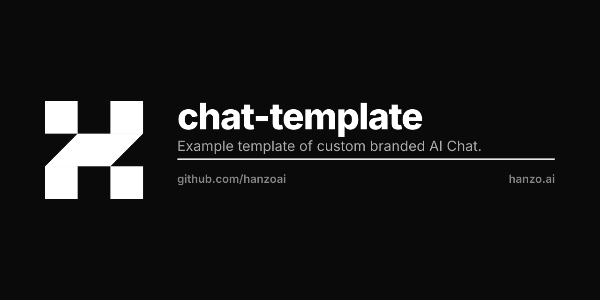

<p align="center"></p>

# AI Chat - Custom Branded Deployment

A minimal, clean deployment of Hanzo Chat with AI branding and custom tools.

## Quick Start

```bash
# Initialize environment (copy template if missing)
cp .env.example .env

# Start AI Chat
make up

# View logs
make logs

# Stop
make down
```

AI Chat will be available at http://localhost:3081

## Structure

```
chat/
├── .env                 # Branding and configuration
├── docker-compose.yml   # Main services
├── compose.prod.yml     # Production overrides
├── Makefile            # Simple commands
├── branding/           # Custom assets
│   ├── logo.svg
│   └── favicon.svg
├── tools/              # Custom MCP tools
│   └── financial/      # Financial analysis tools
├── models.yaml         # Custom model endpoints
└── data/               # Persistent storage
```

## Configuration

### Branding (`.env`)

# Copy the environment template and update values:
```bash
cp .env.example .env
```

```env
# Brand Configuration
BRAND_NAME=AI
BRAND_TITLE=AI Chat
BRAND_DESCRIPTION=AI-Powered Financial Document Analysis
BRAND_PRIMARY_COLOR=#6B46C1

# API Keys - Uncomment and add your keys
# OPENAI_API_KEY=sk-...
# ANTHROPIC_API_KEY=sk-ant-...

# Or use local API
# LOCAL_API_URL=http://localhost:4000/v1
```

**Important**: Don't leave API keys empty (`OPENAI_API_KEY=`) as this will override system environment variables. Either set a value or comment out the line.

### Custom Models (`models.yaml`)

```yaml
endpoints:
  - name: "AI Finance Models"
    baseURL: "${LOCAL_API_URL}"
    models:
      - ai-financial-v1
      - ai-credit-v1
```

### Custom Tools (`tools/`)

Place MCP tool configurations in the tools directory:

```
tools/
├── financial/
│   ├── config.json
│   └── server.js
└── credit/
    ├── config.json
    └── server.js
```

## Features

- **Dynamic Branding**: All branding controlled via `BRAND_*` environment variables
- **Custom Tools**: Mount your own MCP tools in `/tools`
- **Custom Models**: Configure additional model endpoints
- **Demo Mode**: Automatic demo login on localhost
- **Production Ready**: Includes production compose file with SSL, monitoring

## Demo Login
When `DEMO_MODE=true`, `SHOW_DEMO_LOGIN=true`, and running on localhost:
- Email: `${DEMO_EMAIL}`
- Password: `${DEMO_PASSWORD}`

## Production Deployment

```bash
# Configure production domain
echo "DOMAIN=chat.ai.ai" >> .env.prod

# Start with production config
make prod
```

## Testing

```bash
# Run tests to verify branding and tools
make test
```

This runs:
- Branding verification
- Custom tool availability
- Model endpoint connectivity
- Demo login functionality

## Customization

1. **Branding**: Update `BRAND_*` variables in `.env`
2. **Tools**: Add MCP servers to `tools/`
3. **Models**: Configure endpoints in `models.yaml`
4. **Assets**: Replace files in `branding/`

## Requirements

- Docker & Docker Compose
- API keys (OpenAI/Anthropic) OR local LLM endpoint

## Support

- Documentation: https://ai.ai/docs
- Issues: https://github.com/hanzoai/chat/issues